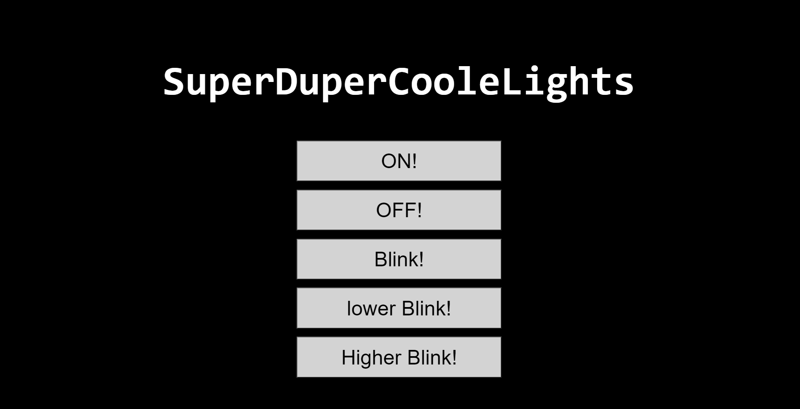

# ChristmasLights
Controlling our Christmas Lights over the Web with ESP8266

You need a IR Sender which is hooked up to the D2 Port on your ESP8266 it just simulates the IR Remote of [this](https://shop.krinnerusa.com/lumix-led-christmas-tree-candles/lumix-suplerlight-crystal-mini-cashmere.html) Christmas lights.

## TODO:
- Send the Code more often!!!

